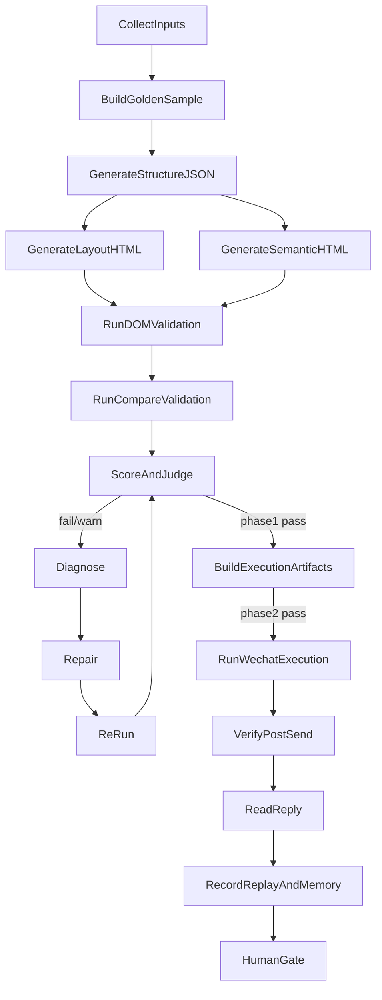

# LangGraph / Durable Execution Graph

## 1. Graph overview

## 2. Node catalog
### CollectInputs
- inputs: requirement, preflight, source screenshot, external reference manifest
- outputs: normalized capture inputs, initial state snapshot
- gate: provenance complete
- repair: retry import only
- auto-retry: limited
- human gate: no

### BuildGoldenSample
- inputs: raw evidence + provenance
- outputs: candidate sample workspace + evidence index
- gate: no overwrite of frozen sample
- repair: copy/sync only
- auto-retry: limited
- human gate: yes for freezing

### GenerateStructureJSON
- outputs: detect/regions.json, detect/layout_model.json, infer/app_classification.json, infer/zones.json, infer/action_targets.json
- gate: page identity and zone completeness not blocked
- repair: detect/infer tuning

### GenerateSemanticHTML
- outputs: infer/semantic_model.json, mirror/semantic.html
- gate: semantic nodes complete and source-mapped

### GenerateLayoutHTML
- outputs: mirror/layout.html
- gate: layout HTML JSON-driven only

### RunDOMValidation
- outputs: mirror/dom_validation_report.json
- gate: required DOM counts and uniqueness checks satisfied

### RunCompareValidation
- outputs: compare/report.json, compare/diff.png
- gate: weighted compare score acceptable or warn-only

### ScoreAndJudge
- outputs: decision.json
- gate: no unresolved hard-gate failure

### Diagnose
- outputs: failure taxonomy binding, repair plan
- gate: failure code + owner determined

### Repair
- outputs: deterministic patch/config change or rule change
- gate: isolated write scope

### ReRun
- outputs: refreshed artifacts from stable checkpoint
- gate: no duplicated side effects

### BuildExecutionArtifacts
- outputs: infer/chat_candidates.json, verify/actionability_report.json, verify/send_safety_report.json
- gate: Phase 2 readiness without enabling send by default

### RunWechatExecution
- outputs: action evidence, updated checkpoints
- gate: send safety pass + human gate
- retry: no blind retry of send

### VerifyPostSend
- outputs: post-send verifier result
- gate: draft clear + self message + header consistency

### ReadReply
- outputs: reply readback artifact
- gate: latest reply window attributable or explicitly unresolved

### RecordReplayAndMemory
- outputs: replay_result, state_transition_log, approved memory write
- gate: only approved conclusions enter memory

### HumanGate
- outputs: human verdict
- gate: required evidence reviewed

## 3. Durable execution policy
- deterministic transforms may replay freely
- external observations may retry under low-risk policy
- high-risk actions such as send never auto-retry
- human review is a first-class node
