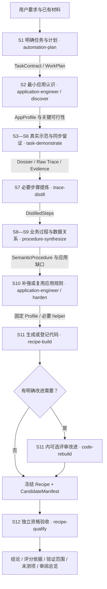

# Agent-to-Recipe：怎样判断每个环节做对了

**主链按成果变化组织，Skill 按专业职责复用，检查按生产者／消费者边界执行。**
保留 S1—S12，不把八个交接边界变成八个强制 Skill，也不增加运行引擎。
本页是既有设计的审阅投影和实施导航，不是另一份 schema、Gate 或可执行 DSL。

## 一、旧任务树怎样继续使用

[task-decomposition.md](task-decomposition.md) 仍拥有完整任务分解、五个结果层次、三个循环和历史 R1—R13 对照；不是过期后全部丢弃的材料，也不是已验收证明。
本页只抽取它的关键交接，不复制全部子任务。原方法、合同、产物与测试各自有唯一职责：

| 材料 | 用来判断什么 | 不能据此推断什么 |
| --- | --- | --- |
| [requirements.md](requirements.md) | 用户要求、来源、范围与需求基线 | 有一条需求就已实现 |
| [task-decomposition.md](task-decomposition.md) | 是否遗漏必要子目标、循环、恢复和维护任务 | 每个叶节点都必须成为 Skill 或 JSON |
| [chain-design.md](chain-design.md) | 职责、输入输出、组合、复用与失败归属 | 职责名称就是可调用实现 |
| [共享合同](../../../docs/frameworks/agent-to-recipe-skill-contract.md) | 字段含义、版本、交接与不可逆事实边界 | 符合格式就证明事实发生过 |
| Skill 方法文件 | 如何生产本职责的成果 | 文件存在就已安装或具备稳定模型行为 |
| [validation-plan.md](validation-plan.md) | 行为案例、正反测试、唯一评分规则 | 测试计划存在就已经通过 |
| 本页与生成的审阅 View | 一眼看清输入输出、检查范围和下一责任方 | 页面显示 PASS 就取得业务资格 |

## 二、主链：在箭头上写交付物，在节点上写职责



图中是目标专业职责，不是声称全部方法或自动调度已实现。S2／S10 共用一个 Skill；S11 可以涉及两个职责。
每个交接都遵守：**固定输入 → 生产固定输出 → 支持范围内的检查 → 适用 G0—G7 → 发布 handoff → 下游核验后消费。**
失败按责任返回，不是无条件回 S1；当前桌面、授权和可变状态仍需在实际执行前核对。

## 三、八个边界怎样判断

下表中的内容是消费者需要的信息，不要求每项独立建文件。字段细节只在共享合同维护。

| 边界与方法 | 输入里需要看到什么 | 输出里需要看到什么 | 放行判断／错误返回 |
| --- | --- | --- | --- |
| S1 · automation-plan | 原始目标、来源、已有资产、授权 | TaskContract：成功与禁止条件；WorkPlan：子目标、依赖、检查点和未知 | 要求是否遗漏、计划是否越权；错误回 S1 |
| S2 · application-engineer / discover | 合同与近期步骤、实际观察、旧 Profile | 哪个窗口、如何定位／读取、必要状态、证据与限制 | 关键读值能否取得；资料缺口回应用工程，路线冲突回 S1 |
| S3—S6 · task-demonstrate | 固定计划／Profile、实际输入与授权 | planned／actual、关键动作、实际值、消费者、结果及原证据 | 事实是否发生、是否完整／限定范围；缺事实回本环节补采 |
| S7 · trace-distill | 固定 Dossier、Raw Trace、合同／计划和必要证据 | DistilledSteps：保留／合并／省略依据、来源、输入输出与依赖 | 必要读值是否误删、merge 是否丢源动作；取舍错误回 S7，缺事实回示范 |
| S8—S9 · procedure-synthesize | 必要步骤、任务约束、应用资料 | Business Steps、参数分类、真实值生产者／消费者、允许变换与范围 | 解释与数据关系是否改变；语义回本环节，取舍错误回 S7 |
| S10 · application-engineer / harden／repair | 已确认 Procedure、应用规则缺口 | 有来源和失效条件的定位／读取／动作规则、必要 helper 与局部验证；或精确复用旧版本 | 每项必要操作能否落实；规则错误回应用工程，不改业务要求 |
| S11 · recipe-build／可选 code-rebuild | 固定过程、实际规则／API、代码基线与允许变更范围 | 普通 JS、CandidateManifest、步骤到函数映射、改进或保留结论 | 代码是否忠实消费实际值；实现错回 S11，语义／规则错回上游 |
| S12 · recipe-qualify | 精确候选／依赖、预先固定标准、请求场景和授权 | QualificationRecord、实际执行和独立观察、已测／未测范围、修复请求 | 同一候选和真实业务是否合格；按缺陷责任返工，不修改候选后沿用旧资格 |

## 四、用一个值贯穿检查，而不只看文件名称

以下对应 [source.json](../../../tests/workflows/fixtures/calculator-artifact-chain/source.json) 的**合成 fixture**，是字段节选，不是完整生产工件或历史运行证明。

| 层次 | 能在材料里直接检查的内容 | 应拒绝的反例 |
| --- | --- | --- |
| 用户目标／合同 | 第一次 UI 读值必须成为第二次输入；Expected 只供测试判断 | 将期望 110 作为生产输入来源 |
| Dossier／actions | A005 记录 firstResult 的读取；A009 记录第二次实际输入；runtimeValues 连接二者 | 只有最终 660，没有第一次实际来源；消费者写成不存在的 A999 |
| DistilledSteps | D030 引用 A005 并输出 firstResult；D050 引用 A009 并消费 firstResult | 将 A005 标 merge，却从 D030 的 sourceActionRefs 删除 |
| Procedure | B025 从 D030 取得真实值；B040 从 D050 消费；dataDependencies 显式连接 | 改成默认参数 110，或把生产者换到无关步骤 |
| Candidate | readCalculatorResult 的返回值赋给 firstResult；后续调用展开同一值 | 实际读了 firstResult，却在后续输入固定 110 |
| Qualification | candidateRef 固定候选字节；qualified 不超出 exercised、不与 excluded 重叠 | 修改脚本继续用旧清单；未测试的范围也写 qualified |

S7 的“必要”是有来源的判断，不是检查器对任意任务因果关系的证明。
候选的源码模式匹配也不证明任意 JS 可达性、别名或变量遮蔽；静态审阅、运行时观察和独立资格仍需分别完成。

## 五、已经可以运行的增量检查

复用 `check-artifact-chain.js`，不新增平行 validate-stage 引擎。`--through` 指定**检查到哪个边界**，包含必要上游核对，不是跳过前置检查。
默认仍检查到 qualification；缺文件不能自动缩小范围。

| --through | 必需入口文件 | 不需要伪造的未来成果 |
| --- | --- | --- |
| trace-distill | dossier、actions、distilled；合同／计划从固定引用读取 | Procedure、Candidate、Qualification |
| procedure-synthesize | 上述三项＋procedure | Candidate、Qualification |
| candidate | 上述四项＋candidate | Qualification |
| qualification（默认） | 六项全部 | 无 |

当前实现只支持 **Calculator 形状 v1、单个固定计划版本、成功正常路径**。通用 S1／S2／S10 Validator、任意轨迹和完整 Stage Contract 没有因此实现。
多计划版本、复杂恢复、仅语义就绪但应用方法尚待验证的过程，不得改写事实以适配此切片；按实际缺口补合同／规则与测试。

从仓库根目录运行测试：

```bash
node --test tests/workflows/artifact-chain.test.js
```

当前任务已有实际文件时，以下为参数模板；不要复制占位值后补造文件：

```bash
node workflows/agent-to-recipe/scripts/check-artifact-chain.js --through trace-distill --dossier <dossier.json> --actions <actions.json> --distilled <distilled-steps.json> --root <id=directory> --format markdown
```

默认 JSON 报告和 Markdown 审阅页源自同一次检查。用户可将 stdout 保存到该任务 `.runtime/` 下；工具自身不写文件、不修改工件、不运行候选、不授予权限。
默认六工件命令仍可使用；新增合同／计划一致性检查可能揭示旧任务包缺口，不能为了兼容而跳过或倒填来源。

### 审阅页实际显示什么

- 检查截止边界、各边界局部规则结果，以及受上游失败阻塞的结果。
- 本次读取的工件路径和 SHA-256；实际任务／计划、动作、步骤、输入输出、数据依赖、代码映射和资格声明。
- 失败位置、原因与责任边界；明确没有检查的内容。
- 无下游工件的边界显示 `not-run`，不能出现虚假的 S12 PASS。
- 文本按不可信数据转义；长内容明确标记截断，检查仍使用完整输入。

审阅页是 View，不拥有新的完成语义；输入改变后重新生成。消费者应重跑检查，不能信任可手工编辑的 PASS 报告。
`localChecks` 是局部规则诊断；`boundaries` 加上前置依赖判断。这里的 `blocked` 不是新增 G 编号或修改 handoff 枚举。
`stageComplete=false`、`liveQualificationGranted=false` 明确表示本工具没有完成全部 Stage 接受责任。

## 六、四个补齐方法的实际边界

| 方法 | 本次可用成果 | 仍需独立证明 |
| --- | --- | --- |
| [trace-distill](../skills/trace-distill/SKILL.md) | 输入输出样例、S7 前缀检查、保留／合并来源反例、返工方法 | 模型能否从未见轨迹稳定产生正确 DistilledSteps |
| [procedure-synthesize](../skills/procedure-synthesize/SKILL.md) | 语义与数据关系样例、S9 前缀检查、错误映射反例 | 独立上下文 Producer 行为、跨应用与多消费者泛化 |
| [code-rebuild](../skills/code-rebuild/SKILL.md) | 固定基线评审方法、必须交付的结论表、无需先有资格的候选检查 | 多种代码缺陷的实际审阅能力、评审一致性、当前候选真实重验 |
| [recipe-qualify](../skills/recipe-qualify/SKILL.md) | S12 冻结 Candidate 的场景计划、QualificationRecord、Recipe Review／评分证据边界与返修路由 | 宿主自动加载、跨任务资格一致性、隔离上下文审阅和新的 live 业务样本 |

application-engineer 继续服务 S2／S10，本次未改变其实现。recipe-qualify 已有方法文件；automation-plan、task-demonstrate、recipe-build 仍是共享合同中的目标职责，不能虚构同名命令或把它们列成已安装方法。

## 七、问题清单与推进顺序

| 本轮问题／旧任务树来源 | 方案决定 | 实现与验证位置 | 后续缺口 |
| --- | --- | --- | --- |
| 主链看不出产物是否正确；S1—S12／三个循环 | 保留完整任务树，用交接地图、字段例子和反例审阅 | 本页＋四个补齐方法文件 | 在更多真实任务中验证覆盖 |
| S7／S9／S11 要等 S12 才能检查 | 在原检查器增加显式前缀 | check-artifact-chain.js；artifact-chain.test.js | 不是全部 Stage Validator |
| 输入版本／事实关系可能错误 | 核对合同与计划绑定、计划修订、动作来源及消费者 | 正反 Fixture 合同测试 | 可信宿主记录、签名／隔离和多修订轨迹 |
| 代码优化后缺清楚结论；S11 质量作业 | 固定对象、改动去向、评分依据、未测范围与下一步 | code-rebuild 方法中的结论表 | 评审 Producer 的行为数据集与校准 |
| 工件难读；可读 View | 程序生成内容与检查总览，不让模型另写成功故事 | stage-review.js＋CLI Markdown 测试 | 当前只覆盖支持的工件切片，不是完整任务门户 |
| 方法文件状态互相矛盾 | 分开记录文件、确定性工具、模型行为、宿主加载、真实业务 | 设计入口＋本页＋本轮质量记录 | 不从文件存在外推通用能力 |

下一步优先使用 Frozen Fixture 对真实模型 Producer 做独立输入／输出试验，再推进相邻实际 Skill 集成；保持 Expected 与 Producer 输入隔离。
随后才在本地获准环境核对实际任务包、同一候选及必要 Calculator Fresh Run，不重跑已经有有效证据的无关工作。
API Markdown 体系、Runtime、S1—S12、G0—G7 和普通 JS 交付方式均不重设计。

本轮事实、测试数量和未测项见[阶段边界修复记录](../../../docs/quality/agent-to-recipe-stage-boundary-review-20260919.md)。
